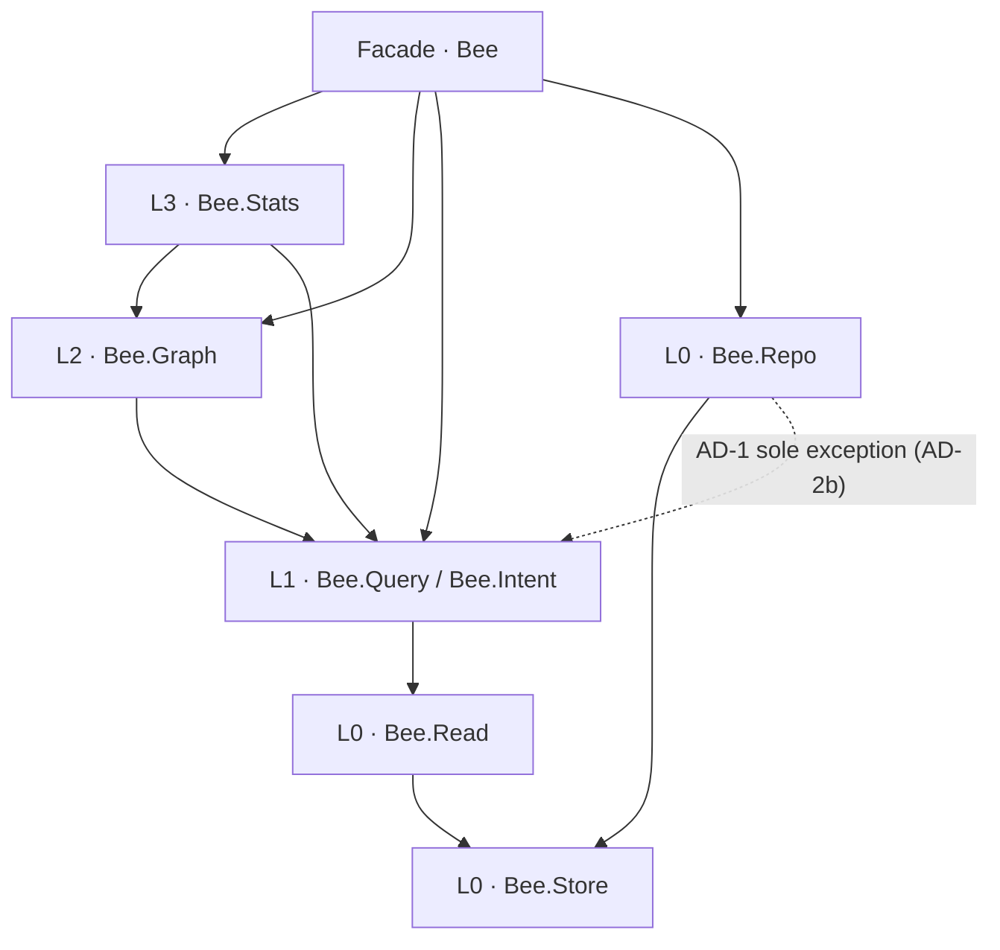

# Architecture Spine — bee

> **Authoring rule 1 — no duplication.** Every fact is stated in exactly ONE place; other sections reference it by AD number.
>
> **Authoring rule 2 — no unqualified absolutes.** Every absolute ("only", "never", "no", "always", "every", "sole", "exhaustively") carries its exception list inline, or explicitly declares it has none. Absolutes are tagged **[abs]** so the list below is mechanically checkable.
>
> **Authoring rule 3 — cross-product new enumerations against new absolutes.** No revision adds a closed list *and* a table without multiplying them against each other. Three of v4's seven criticals were a new table and a new closed list, each correct, never checked against the other.

## Mission

Bee is a self-contained intelligent work engine, not a store its consumers compensate for. **A consumer describes what it wants; bee decides how to answer.** Capability requiring knowledge of the DAG, its history, or its statistics belongs *in bee*.

**[abs] Exceptions to this presumption, exhaustively two:** AD-6, and the Deferred rows marked *bee-defers-to-consumer*.

## Design Paradigm

| Layer | Namespaces |
| --- | --- |
| **L4 Facade** | `Bee`, `Bee.Application` |
| **L0 Substrate** | `Bee.Store` (schema, migrations, tables, ids, events, measurements, intents, acyclicity, export), `Bee.Read`, `Bee.Repo` |
| **L1 Query** | `Bee.Query` (spec, interpreter, classifier, projection, transform, withheld, candidates), `Bee.Intent` |
| **L2 Graph** | `Bee.Graph` |
| **L3 Intelligence** | `Bee.Stats` |

**[abs] Every namespace in the codebase appears in this table; there are no others.**



## Invariants & Rules

### AD-1 — Dependencies run downward, any distance, with one named exception

- **Binds:** all modules
- **Prevents:** import cycles; L0 becoming untestable without the whole stack
- **Rule:** a module may depend on any layer below its own, at any distance; same-layer dependencies are legal.
  - **[abs] Sole upward exception:** AD-2b permits `Bee.Repo` (L0) to invoke `Bee.Query.Interpreter` and `Bee.Query.Candidates` (L1) with an injected connection. Drawn dotted. Adding another is a spine amendment.
  - Acyclicity (`Bee.Store.Acyclic`) and export (`Bee.Store.Export`) live at L0 specifically so neither needs a second upward edge.

### AD-2 — One writer, pooled readers [ADOPTED]

- **Binds:** every database access
- **Prevents:** concurrent writers corrupting id allocation and cycle checks; readers serializing behind writes
- **Rule:** all mutations go through the single `Bee.Repo` GenServer. **[abs] At most one read-write connection exists at any instant, with no exception** — `Bee.Store.Migrate`'s is closed before `Bee.Repo` opens its own (AD-22 ordering), so the two never coexist. All external reads go through `Bee.Read` pooled read-only connections. WAL mandatory.
  - **[abs] Modules that open their own connection, exhaustively one:** `Bee.Store.Migrate`, whose connection exists only before `Bee.Repo` starts and is closed before it returns `:ok`. It must, since it runs before either connection owner exists.
  - Every other database access borrows a connection from `Bee.Repo` (writes and writer-internal reads, AD-2b) or `Bee.Read` (caller reads). **Control-table reads** — `locks`, `intents`, `intent_usage`, `measures` — run on whichever connection their caller already holds; they are ordinary function calls, not connection owners.

### AD-2b — Writer-internal work uses the writer's own connection

- **Binds:** `Bee.Repo`, `Bee.Query.Interpreter`, `Bee.Query.Candidates`, `Bee.Store.Acyclic`, `Bee.Store.Export`, `Bee.Store.Locks`, `Bee.Store.Intents`, `Bee.Store.Measurements`
- **Prevents:** pool-checkout deadlock from inside the writer; cycle checks reading a snapshot excluding the in-flight edge; and modules the writer must call having no connection they may legally use
- **Rule:** any read or write performed **by the writer process** — inside the command transaction (cycle checks, control-table lookups) or after commit (candidates, export flush) — runs on the writer's connection, passed as an argument. The writer never calls `Bee.query/1` and never checks out from `Bee.Read`. This AD governs *which connection*; AD-19 governs *when*.

### AD-3 — Two reader lanes, classified by spec shape alone [ADOPTED]

- **Binds:** `Bee.Read.Pool`, `Bee.Query.Classifier`
- **Prevents:** head-of-line blocking relocating into a shared pool; classification drifting to cost-based heuristics
- **Rule:** `:fast` pool sized `System.schedulers_online()` capped 8; `:compute` pool sized 2. Classification is a total function of spec shape only — never row estimates, never data volume:

  | spec field present | lane |
  | --- | --- |
  | `via:`, `rollup:`, `stats:` | `:compute` |
  | any attribute transform above `:pushdown` (a `:local` or `:external` tier, AD-27) | `:compute` |
  | `search:` or anything else | `:fast` |

  Any `:compute` trigger wins (union semantics). **Transform tier is spec shape**, so classifying on it is consistent with this AD, not an exception. **A test asserts every `Bee.Query.Spec` field appears in this table** — including the tier dimension; a field or tier added without a row fails that test. (A compile-time guarantee is not achievable — the catch-all row matches any unknown field.)
- **Accepted cost:** under an all-analytics burst a `:compute` query queues behind another while `:fast` connections idle. Accepted because bee's common case is cheap agent reads. **Merging the pools reverts an operator decision and is a spine amendment.** Consequence for AD-23: up to 10 persistent readers exist.

### AD-4 — Read paths are three, and SQL is confined

- **Binds:** `Bee.Query`, `Bee.Intent`, `Bee.Graph`, `Bee.Store`, the facade
- **Prevents:** two read surfaces drifting; traversal bypassing the interpreter and re-implementing filters, ordering and projection
- **Rule, clause 1 — [abs] every read falls into exactly one of three categories, partitioned by who performs it, and there are no others:**
  1. **Caller-facing queries** — a caller asked for issues. Resolve to a `Bee.Query.Spec` executed by `Bee.Query.Interpreter`. `ask/2` resolves an intent to a spec, then calls the same interpreter. L2 traversal belongs here: it expresses itself as spec fields (`via:`), not its own SQL.
  2. **Writer-internal reads** — the writer needs to know something to decide. Performed on the writer's connection by the module that owns the data (AD-2b's binds list is exactly this set): cycle checks (`Bee.Store.Acyclic`), candidate generation (`Bee.Query.Candidates`), and control-table lookups (`locks`, `intents`, `intent_usage`, `measures`, migration state). The *result* may reach a caller — candidates do — but the *read* is issued by the writer for its own purposes, which is what places it here.
  3. **Bulk serialisation** — `Bee.Store.Export` (AD-17) emitting every row for the JSONL contract. Does **not** resolve to a Spec: it projects no fields and applies no filters. AD-24's "export bypasses Projection" follows from this category rather than being an exception to it.
- **Rule, clause 2 — [abs] SQL string construction occurs only in `Bee.Query.Interpreter` and `Bee.Store.*` (which includes `Migrate` and `Export`); no other module, with no exceptions.** `Bee.Intent.Registry` therefore owns no SQL and delegates to `Bee.Store.Intents`.

### AD-5 — Intents are two structurally separate classes [ADOPTED]

- **Binds:** `Bee.Intent.Core`, `Bee.Intent.Registry`, `Bee.Store.Intents`
- **Prevents:** the catalogue freezing at design-time guesses; and rotting into an unpruneable dumping ground
- **Rule:** **Core** intents are code — compiled, versioned, may run arbitrary Elixir, named by **atoms** (closed set), existing only where answering needs knowledge a consumer cannot reasonably reproduce. **Registered** intents are data — a name plus a stored spec in the `intents` table, added/removed at runtime with no release, named by **strings** (open set), expressing anything `Bee.query` can and nothing more. A registered spec is **validated by `Bee.Query.Spec` at registration time** and rejected with `:invalid_spec`; resolution never validates. Lookup dispatches on type — atom to core, string to registry — so a core name and a registered name can never collide. Pruning is by evidence via AD-20.

### AD-6 — Bee does not model work execution [ADOPTED]

- **Binds:** all layers, especially L3
- **Prevents:** bee absorbing the time-tracking domain and coupling to a live external service
- **Rule:** bee holds **no domain concept** of resource capacity, availability, cost rates, or working time. It captures its own events unconditionally and accepts outside signal to calibrate itself.
  - **[abs] This constrains bee's *domain model*, not its *runtime*.** Internal timers (export debounce, lock expiry, WAL checkpoint, usage-count coalescing) are implementation mechanics and are not the subject of this AD.
  - **Unit validation is not domain modelling.** AD-9 rejecting a unit mismatch is arithmetic hygiene, not a claim about what a quantity means.

### AD-7 — Events: derived, one emitter, one event per accepted command

- **Binds:** `Bee.Repo`, `Bee.Store.Events`, all of L3
- **Prevents:** a builder treating bee as event-sourced and rebuilding state by replay; two emitters double-writing; and "one mutation" read at field granularity by one unit and command granularity by another
- **Rule:** state lives in `issues` and its satellites; `events` is an append-only **derived record**. Nothing reconstructs state from it.
  - **[abs] `Bee.Store.Events` is the sole module inserting into `events`; no exceptions.**
  - An ***accepted* command** passed validation AND produced a non-empty delta. An empty delta emits no event and returns `{:ok, report}` with an empty `applied` list.
  - **[abs] One accepted command emits exactly one event**, whatever it touched — including a command carrying `measure:` (AD-9b). **Exceptions, exhaustively:** the seven non-command writes enumerated in AD-19, which emit none.
  - Names come from the function→event table, the sole naming authority.
  - `events.issue_id` is `NOT NULL`, which is why non-issue-scoped writes cannot be commands.
- **Column contract:** `id INTEGER PRIMARY KEY AUTOINCREMENT` (global cursor); `seq INTEGER NOT NULL` (per-issue monotonic); `UNIQUE(issue_id, seq)`; `actor TEXT`; `created_at TEXT NOT NULL`.
- **[abs] Retention: keep forever — no compaction, no aging, no deletion, no exceptions.** ~20k rows / ~7 MB for all history to date. Events are the one unrecreatable asset and L3's only input. Adding a compactor is a spine amendment.

### AD-8 — Event payloads use a canonical envelope [ADOPTED]

- **Binds:** `Bee.Store.Events`
- **Prevents:** payloads opaque to SQL; unbounded growth from repeated edits; two units inventing different shapes, key spellings, or id forms
- **Rule:** payloads are JSON (never `:erlang.term_to_binary`):
  ```json
  {"fields": {"status": "closed", "parent": "GC-5",
              "measure": {"name": "effort", "value": 90.0,
                          "unit": "minutes", "dims": {"kind": "actual"}, "seq": 41}},
   "rejected": {"priority": "invalid_dimension_key"},
   "refs": {"comment_id": 91}}
  ```
  - **[abs] `fields` keys are exactly the storage column names of the mutated row, with exactly one exception:** `measure`, whose value is the envelope shown above. `seq` in it lets L3 join the event to its `measurements` row without a second query.
  - **[abs] `fields` values are the after-values of those columns, with exactly one class of exception:** id-valued columns (`parent`, `project_id`, `assigned_to`) carry **prefixed strings** per AD-24, not the raw integer.
  - `refs` values are satellite row ids (integers); they have no prefixed form and are outside AD-24's scope.
  - `rejected` maps field name to an atom from the error vocabulary — not a bare array.
  - `actor` and timestamps live in event columns (AD-7), never in the payload.
  - Above 2 KB a value becomes `{"_truncated": true, "sha256": "…", "bytes": 8113, "preview": "…"}`.

### AD-9 — Measures are registered with a unit; dimensions are free but grammared

- **Binds:** `Bee.Store.Measurements`, `Bee.Stats`, `Bee.Query.Interpreter`
- **Prevents:** summing seconds with milliseconds under one measure name; `duration` vs `Duration` as keys; silent full-table scans from expression-index misses
- **Rule:**
  - Measures register at runtime, as AD-5 registers intents — open set, persisted in `measures`. Registration binds exactly one unit. Unregistered ⇒ `:unknown_measure`; conflicting unit ⇒ `:unit_mismatch`. **Re-registering a name with its existing unit is an idempotent no-op.**
  - Dimensions stay schemaless under a grammar: keys `^[a-z][a-z0-9_]*$` (violation ⇒ `:invalid_dimension_key`), values strings, `dims` defaults `'{}'`, never `NULL`, keys serialized sorted.
  - **Expression indexes require exact textual match** — SQLite performs no algebraic equivalence — so the interpreter emits `json_extract(dims, '$.key')` in one canonical form; `->>` is forbidden.
- **Column contract:** `measurements(id, issue_id NOT NULL, seq NOT NULL, measure, value REAL, unit, dims, source, recorded_at)`, `UNIQUE(issue_id, seq)`. **`seq` is the ordering authority; `recorded_at` is descriptive only.**

### AD-9b — Measurement intake is the default path

- **Binds:** `Bee.Repo`, the facade
- **Prevents:** the capture mechanism staying empty because recording is a separate step someone forgets
- **Rule:** `update/3` and the close path accept `measure:`, recorded in the same command transaction (AD-19) and appearing in that command's single event under `fields.measure` (AD-8). **The intake path sets `dims.kind` to `"actual"` when the caller omits it**, so AD-12's grouping key is always populated. `Bee.measure/3` is a standalone command for out-of-band and retroactive recording, emitting `measurement.recorded`.

### AD-10 — Output is shaped per attribute; enrichment is opt-in and absence is explicit [ADOPTED]

- **Binds:** `Bee.Query.Projection`, `Bee.Query.Transform`, every read path
- **Prevents:** N+1 enrichment (~4 queries per row); `blocked_by: []` on a blocked issue, indistinguishable from truth; and a fixed detail-level enum straitjacketing output when a caller needs one field summarised, another full, another merely present
- **Rule:** output is shaped by **two orthogonal per-attribute knobs**, not a fixed detail enum:
  - **Role** — which clause an attribute lands in: `retrieve` (project), `filter` (`where`), `group` (aggregation key), `scan` (search target). One attribute may wear more than one role.
  - **Granularity** — each *retrieved* attribute carries a **granularity**: an **operation** (`full` — the identity, returns the whole value; `char-prefix`; `presence`; `relation-count`) run at a **tier** (which module performs it — the tiers, what bee ships, and the failure contract are AD-27's, referenced not restated here). `refine` names `granularity: full` to recover a value returned at any other granularity.
  - **`detail:` levels are presets, not the primitive.** `:minimal | :compact | :standard | :full` (default `:compact`) plus **`:custom`** (a caller-supplied attribute→transform map) are named **assignments** over the two knobs — `:minimal` = presence/id everywhere, `:full` = full everywhere. `:custom` is first-class, not a fallback.
  - Relations load only via `include:`, batched per result set.
  - **Fields and relations behave differently, deliberately.** A **field** below the selected shape is an **absent key** — that is what the shape *is*; a consumer needing it selects a higher preset or `:custom`. A **relation** (`labels`, `blocked_by`, `comments`, `lock`, `children`, `measurements`) is never absent.
  - **[abs] A relation not loaded carries `:not_loaded` — never `[]`, `nil`, or an absent key; no exceptions.** `[]` is the dangerous case: on a blocked issue it silently asserts "no blockers" and corrupts every readiness and rollup computation downstream, indistinguishably from truth.
  - When a core intent loads a relation the caller's shape excludes, the caller wins and `withheld[:projected_out]` records it. Id integerisation is projection, not enrichment: it happens at every level.

### AD-11 — A read reports what it withheld [ADOPTED]

- **Binds:** `Bee.Query.Interpreter`, `Bee.Query.Withheld`
- **Prevents:** agents defensively requesting maximum detail because an incomplete answer is indistinguishable from a complete one
- **Rule:** every result carries `withheld` (always present, `%{}` when empty) keyed only from the withheld vocabulary, plus `refine` — a keyword list of options that would return more, `[]` when none would. Silent truncation is forbidden.
  - **Withheld values are of two kinds — count-valued and presence-valued — and the vocabulary declares which each is.** Count-valued entries report a row count (e.g. a page-truncated result). **`:missing_measure` counts nodes.** **Presence-valued** entries report *that* something was withheld, not a count: **`:relation_omitted`** (a relation not `include:`d was not queried at all, so no count was computed — a count is available on request via a `:pushdown` `relation-count` granularity, AD-10, so `withheld` reports presence rather than run an unrequested query) and **`:transformed`** (below — what is withheld is the untransformed value, a value not a count).
  - **Per-attribute transform reporting.** When an attribute is returned at a reduced granularity (AD-10 — a `char-prefix`, a `:local` trim, an `:external` summary), `withheld[:transformed]` names, **per attribute, the operation applied and its tier**, and `refine` gives the `granularity: full` spec (AD-10's identity operation) that returns the whole value. A caller therefore never mistakes a prefix or an LLM summary for the source.

### AD-12 — One rollup aggregator; effort is a measurement

- **Binds:** `Bee.Graph.Rollup`
- **Prevents:** three divergent sums; and a 69-node tree where 60 nodes lack estimates rolling up to a confident, tiny, wrong number
- **Rule:** total effort is the base additive primitive over a node set; scope selectors choose the set, one aggregator computes over it.
  - **Scope selectors and their boundaries:** `:tree` — the parent subtree; dependencies crossing it appear under `gates:`, never in totals. `:closure` — the transitive gating-dependency closure. `:critical_path` — the longest gating chain. **The parent-tree boundary applies to `:tree` only**; the other two are defined by their own edges.
  - **Effort is a measurement** (`measure: "effort"`), **latest by `seq` per `(issue_id, measure, dims.kind)`**. Declared and earned are one measure separated by `dims.kind = "estimate" | "actual"`. No `estimate` column (AD-18). Its unit is a bee-internal arithmetic convention with no semantic claim about human time (AD-6).
  - **Result shape**, verbatim: `%{total: float | nil, partial_total: float, covered: n, missing: m, gates: [...], withheld: %{...}, refine: [...]}` — `float` because `measurements.value` is `REAL`. **`total` is `nil` whenever `missing > 0`**; `partial_total` always carries the sum of what was found.
  - Computed on demand — no materialisation, no cache. Largest measured subtree is 69 nodes.

### AD-13 — Dependency direction and gate semantics are a truth table

- **Binds:** `Bee.Store.Deps`, `Bee.Graph.Ready`, `Bee.Graph.Traverse`, `Bee.Query.Projection`
- **Prevents:** two units inverting the entire graph; `ready` silently mis-answering once non-`blocks` edges exist; and the type vocabulary either rotting below usefulness or sprawling past graspability
- **Rule:** the row `dependencies(issue_id, depends_on_id, dep_type)` means **`issue_id` depends on `depends_on_id`** — `depends_on_id` is the blocker. Traversal edges run blocker → dependent, ratifying `graph.ex:29`. **`PRIMARY KEY (issue_id, depends_on_id, dep_type)`.** Unrecognised type ⇒ `:unknown_dep_type`.
  - **`dep_type` is a closed, compiled, bounded vocabulary — 3 to 7 members** (Miller: three floor, below which the dimension is too thin to be a dimension; seven ceiling, above which it exceeds graspability and dilutes — see `docs/CONSTITUTION.md`). At least three **gate**. It is **not** consumer-registrable (unlike AD-5 registered intents or AD-9 measures): gate semantics drive readiness and are correctness-critical, so they are compiled. Adding a member requires a real, distinct gate/traversal meaning; inventing a speculative type to reach seven is forbidden. The table below is the vocabulary — one row per defined type; it currently sits at the seven-ceiling with three gating types (`blocks`, `waits-for`, `conditional-blocks`). **Only `blocks` is exercised in data today** (`insert_dependency` hardcodes it); which further *defined* types to start writing is an operator decision, not a design gap.

  | dep_type | gates? | `issue_id` is ready when… |
  | --- | --- | --- |
  | `blocks` | yes | `depends_on_id` is `closed` or `cancelled` |
  | `waits-for` | yes | **all** children of `depends_on_id` are `closed`/`cancelled`; **zero children ⇒ satisfied** |
  | `conditional-blocks` | yes | `depends_on_id` is `cancelled`, or `closed` with a `close_reason` **not** in the failure set. A failure close gates permanently — that is the edge's purpose: it exists to hold work back precisely when its blocker failed. |
  | `parent-child` | **no** | never gates. Hierarchy does not block; `waits-for` expresses "wait for my children". Projected from `issues.parent`, never written ⇒ `:unwritable_dep_type`. |
  | `related`, `discovered-from`, `replies-to` | no | never gates |

  Readiness is **one-hop**. **[abs] All three enrichment readers (`store.ex:452`, `:466`, `graph.ex:19`) must filter on `dep_type`** — correct today only because `insert_dependency` hardcodes `'blocks'`.

### AD-14 — `metadata` is the sanctioned extension point; `bee:` is reserved and unused

- **Binds:** schema, all consumers, all bee modules
- **Prevents:** a repeat of the consumer adding an FTS table, three triggers and 19 columns to bee's tables
- **Rule:** `issues.metadata` and `projects.metadata` hold arbitrary consumer JSON, with `bee:` and `_` reserved as prefixes. **[abs] No consumer creates, alters or drops objects in bee's database — no exceptions.** (The current violations are pre-existing and removed by the Hard ordering constraint; this rule is prospective and says so.) `bee:` is reserved **and unused**.
  - **Bee adopts exactly these seven consumer `projects` columns as first-class:** `description`, `stack`, `domain`, `repo_url`, `canonical_path`, `source`, `last_synced_at`. **Migration 000 performs all of it** (see Migration Plan): it creates these seven where absent, and folds every *other* consumer-added `projects` column into `projects.metadata` before dropping it. No later migration touches `projects`.
  - **[abs] No adopted column holds a number bee computes on** (AD-18).

### AD-15 — Migrations: baselined, versioned, additive-tolerant, backed up, fail loudly

- **Binds:** `Bee.Store.Migrate`
- **Prevents:** silent partial migration; bricking the live daemon; destroying data nobody looked at; one migration producing different schemas on different starting databases
- **Rule:**
  - **Baseline.** `user_version = 0` denotes three databases — gc_daemon-live, DevMan, fresh. **Migration 000 normalises all three to one identical schema and stamps version 1.** "Identical" is literal, and achieving it requires both directions: 000 *creates* `projects.metadata` and AD-14's seven adopted columns where absent, *folds* any other consumer-added `projects` column into `projects.metadata`, and *drops* those folded columns. After 000 the `projects` table is byte-identical in shape across all three databases. **[abs] 000 is the sole migration permitted per-state branching**, because it is the migration that creates the invariant every later one relies on — which is precisely why all per-state divergence must be resolved here and nowhere else. An unrecognised `user_version = 0` database refuses to boot with `:schema_unexpected`.
  - **[abs] From version 1 onward every migration is unconditional and produces one schema; no exceptions.** Idempotency lives at the migration level via `user_version`. `IF NOT EXISTS` is forbidden — baseline is what makes that safe.
  - **The `user_version` gate is evaluated before anything else; the backup is taken only if at least one step is pending.** Otherwise a `:rest_for_one` restart loop writes a full database copy per iteration and fills the disk.
  - **Backup via `VACUUM INTO`** to a timestamped path — never a filesystem copy; the WAL is uncheckpointed (measured 4.0 MB) and `cp` yields a torn database. Abort if the backup or its `PRAGMA integrity_check` fails.
  - **One transaction per migration**, `PRAGMA user_version = N` the last statement inside it.
  - **"Unexpected schema" means a bee-owned object is missing or shaped differently than the target version expects.** Additional tables, columns and indexes are tolerated.
  - **Dry-run mode** reports detected baseline, plan and intended DDL without executing.
  - **Post-migration verification**: row-count parity on `issues`/`comments`/`dependencies`/`issue_labels`/`projects`, FTS row parity, and an orphan check **scoped to FK relationships bee enforces** — `issues.parent`, `dependencies.*`, `comments.issue_id`, `issue_labels.issue_id`. It excludes `issues.project_id`/`assigned_to`, whose FKs Deferred deliberately does not restore; asserting on them would `ROLLBACK` against production. Mismatch ⇒ `ROLLBACK`. **Every assertion is computed at runtime from counts read inside the same transaction — never hardcoded.**
  - **Table rebuilds require three pragmas:** `foreign_keys=OFF` before `BEGIN` (a silent no-op inside a transaction), `PRAGMA foreign_key_check` before `COMMIT`, `foreign_keys=ON` after. The migration connection is exempt from AD-23's always-on rule for exactly this window, and restores it before closing.
  - **Migration 001 must be run and verified against a copy of the live production database before it runs against it.**
  - **[abs] One FTS table**, `issues_fts` over `title, description`, **tokenizer `porter unicode61`** — matching gc_daemon's existing index, since changing it silently deletes stemming from every search. Maintained exclusively by triggers named exactly `issues_fts_ai`/`_ad`/`_au`; different names would let gc_daemon's `bootstrap/0` install a second set and double-index every issue. **Drop triggers before the table.**
  - **[abs] Only `Bee.Store.Migrate` creates, alters, or drops database objects — no exceptions**, binding bee's own modules too. Seed DML (AD-9's `effort` registration) is permitted inside a migration.

### AD-16 — The write path proposes structure, never requires it [ADOPTED]

- **Binds:** `Bee.Repo`, `Bee.Query.Candidates`
- **Prevents:** fabricated edges — a required field makes a lazy caller emit `[]` or invent a plausible edge. LLM callers are poor at unprompted recall against a graph they cannot see, and good at judging a concrete proposal.
- **Rule:** create and update return **candidate** edges and related issues, each with a reason and confidence, from FTS + labels + project + comment references. Computed **after commit** (AD-19) on the writer's connection (AD-2b) under a bounded timeout; on expiry the command still succeeds and returns `candidates: :timed_out`. **Accepted cost:** this runs on the single writer, so candidate computation serialises with subsequent commands; the timeout is what bounds the queue. **[abs] No structural field is ever mandatory — no exceptions.**

### AD-17 — Export: a pure module, driven by the writer

*Rewritten from requirements, not amended. The requirements are: flush after quiet periods; flush once on orderly shutdown; never produce a torn file; never hang shutdown; use a connection it is entitled to.*

- **Binds:** `Bee.Store.Export`, `Bee.Repo`
- **Prevents:** an O(n) dump on every mutation; a stale or torn DevMan mirror; and a shutdown that hangs or silently skips the flush
- **Rule:**
  - **`Bee.Store.Export` is a pure module with no process.** It exposes `flush(conn, path, opts)` and holds no state. This is why it needs no supervision slot, no shutdown ordering, and no connection of its own.
  - **`Bee.Repo` owns the debounce timer** and calls `flush/3` on its own connection (AD-2b) after a quiet interval, and once from `terminate/2`.
  - **Writes to a temp path, then atomically renames.** An interrupted flush leaves the previous complete file in place — never a partial one.
  - **The terminate-time flush is bounded** by a work budget; on expiry it abandons the temp file (leaving the last good file intact) and logs. `Bee.Repo`'s `:shutdown` is `:infinity` because it must drain the writer, and this bound is what makes `:infinity` safe.
  - **Crash path:** `terminate/2` does not run on a brutal kill. That is acceptable and deliberate — the JSONL is fully regenerable from the database, so the worst case is a mirror at most one debounce interval stale, never corrupt.
  - The JSONL format is a consumer contract (DevMan, GC-2694). Upsert idempotency lives in `Bee.Store.Issues.insert_issue/1` as `INSERT … ON CONFLICT DO NOTHING`; `Bee.Export.import_jsonl/3`'s blanket `rescue` (`export.ex:106`) is removed only **after** that lands.

### AD-18 — One storage location per fact

- **Binds:** `Bee.Store.*`, `Bee.Graph.*`, `Bee.Stats`
- **Prevents:** rollup walking `issues.parent` while readiness walks a `parent-child` edge; effort arriving via both a column and a measurement
- **Rule:** **[abs] `issues.parent` is the sole storage for hierarchy**; `parent-child` is projected and unwritable (AD-13). **[abs] Measurements are the sole storage for numbers bee computes on** — no `estimate` column, no `metadata` number source, no adopted `projects` column carrying a computed quantity. No exceptions to either.

### AD-19 — One transaction per command, owned by the writer

- **Binds:** `Bee.Repo`, `Bee.Store.*`
- **Prevents:** Store-level and command-level transaction control colliding (SQLite has no nested transactions), and DML committing without its event
- **Rule:** `Bee.Repo` opens exactly one transaction per accepted command and commits it. The mutation, its event (AD-7), and any `measure:` (AD-9b) commit together or not at all. **[abs] `Bee.Store.*` functions never issue `BEGIN`/`COMMIT`/`ROLLBACK`/`SAVEPOINT`/`RELEASE`/`ROLLBACK TO`; no exceptions.** Side effects — export debounce, telemetry, candidate computation, usage counting — fire after commit.
- **[abs] Sanctioned non-command writes, exhaustively seven mechanisms:** intent-usage counting (AD-20), intent registration **and removal** (AD-5 — one mechanism, both directions), measure registration (AD-9 — registration only; measures are never removed, since historical `measurements` rows would lose their unit), `import_jsonl/2` bulk load (AD-17 — `Bee.import_jsonl/2` is the public entry point; `Bee.Export.import_jsonl/3` is its internal implementation), and `register_project/3`, `register_agent/3`, `join_project/3` (project/agent records, which are not issue-scoped and so cannot satisfy `events.issue_id NOT NULL`). **Each emits no event. Adding an eighth is a spine amendment.** **Each still runs in a `Bee.Repo`-owned transaction** — non-command means no event, not no transaction; `Bee.Export.import_jsonl/3` uses one transaction for the whole load, not one per row.
- **L3 consequence:** imports and project/agent creation are invisible to the event log, so statistics about creation must read `issues.created_at` / `projects.created_at`, never event presence.

### AD-20 — Read telemetry is not the event log

- **Binds:** `Bee.Intent.Registry`, `Bee.Store.Intents`, `Bee.Query`
- **Prevents:** polluting `events` with non-mutations, or AD-5's pruning-by-evidence never being implemented
- **Rule:** `events` records mutations only. Intent usage is counted in `intent_usage`, updated by an asynchronous coalesced write dispatched to `Bee.Repo` after the read completes — never on the read connection, never in the read's critical path.

### AD-21 — Acyclicity is guaranteed by a transactional check

- **Binds:** `Bee.Store.Acyclic`, `Bee.Repo`
- **Prevents:** the most dangerous silent regression available here — `:digraph.new([:acyclic])` (`graph.ex:6`) **is** the entire cycle-prevention mechanism, and removing the digraph without a replacement makes `Bee.block/3` accept cycles permanently and undetectably
- **Rule:** `Bee.Store.Acyclic` owns cycle prevention for both dependency and parent cycles (`repo.ex:296-327`). Every `block/3` and every `parent` update is checked **inside the command transaction** via AD-2b, rejected with `:cycle` / `:parent_cycle`.
  - **[abs] The check is a recursive CTE — never a persistent in-memory graph**, because process state cannot roll back with AD-19's transaction and a phantom edge would corrupt every subsequent check. **A graph built and discarded entirely within one read is permitted** — `Bee.Graph.CriticalPath` does exactly that, and it is not a cache.
  - A test asserting cycle rejection is mandatory **before** the digraph is removed.

### AD-22 — Supervision, boot order, and shutdown invariants

- **Binds:** `Bee.Application`, all processes
- **Prevents:** the pool opening connections against a pre-migration schema; and AD-17's flush never executing
- **Rule:** one `:rest_for_one` supervisor, children in this order:
  1. `Bee.Store.Migrate` — transient task; must return `:ok` or the tree fails to start
  2. `Bee.Repo` — **traps exits** (the only child that does; without it `terminate/2` never runs), `:shutdown` `:infinity`, bounded internally by AD-17
  3. `Bee.Read.Pool` — refuses to start if `PRAGMA user_version` is below `Bee.Store.Migrate.target_version/0`
  4. `Bee.Store.Locks.Sweeper`

  There is no Export child — AD-17 makes it a pure module, which is what removes this AD's hardest constraint.
- **Shutdown invariant (ordering IS load-bearing):** OTP terminates children in reverse start order. **`Bee.Repo` must be the last stateful child to terminate.** The Sweeper dispatches writes to it and the Pool holds read connections; both are listed after it and therefore die first. **Reordering children is a spine amendment.** Read-only WAL connections require `-shm`/`-wal` to exist, which the writer starting first guarantees.

### AD-23 — Connection PRAGMAs and an achievable checkpoint protocol

- **Binds:** `Bee.Read.Pool`, `Bee.Repo`, `Bee.Store.Migrate`
- **Prevents:** FK enforcement silently absent (it is per-connection and not persisted — the live database reports `foreign_keys = 0`); and unbounded WAL growth
- **Rule:** **[abs] every connection sets `foreign_keys=ON`, `busy_timeout=5000`, `synchronous=NORMAL`, with exactly one exception:** the migration connection may set `foreign_keys=OFF` for the duration of a table rebuild (AD-15) and restores it before closing.
  - Checkpointing: **`PRAGMA wal_checkpoint(PASSIVE)` on a timer**, plus **`TRUNCATE` at writer terminate**, which succeeds because the pool is already gone (AD-22). `TRUNCATE` on a timer is not used: AD-3 keeps up to 10 persistent readers and TRUNCATE returns busy while any connection reads the WAL. **On the crash path neither runs; the next boot's PASSIVE timer recovers.** The writer logs when the WAL exceeds a threshold.
  - **WAL cannot work over a network filesystem** — a permanent deployment invariant.

### AD-24 — Id form converts in exactly one place

- **Binds:** `Bee.Store.Id`, `Bee.Query.Projection`, `Bee.Store.Export`, `Bee.Query.Candidates`
- **Prevents:** two parse functions arrived at by two agents both obeying "one parse function"; and `"GC-2"` vs `2` in event payloads breaking every `json_extract` comparison
- **Rule:** `Bee.Store.Id` is the sole parser. **[abs] Everything internal uses prefixed strings** — traversal, rollups, event payload `fields` (AD-8), measurement rows, candidate reasons, export JSONL. **Exception, exhaustively one:** `refs` values in event payloads are satellite row ids and have no prefixed form. Conversion to integer happens only in `Bee.Query.Projection`, on the way out; export and candidates do not pass through Projection (AD-4 clause 1 category 3) and therefore carry prefixed strings.

### AD-25 — Structural errors raise; data-dependent outcomes return tuples

- **Binds:** the facade, `Bee.Query.Spec`
- **Prevents:** consumers writing `case Bee.ask(...)` and crashing because the other implementer chose to raise
- **Rule:** **raise** `ArgumentError`, in the caller's process before dispatch, for structural/type errors in *caller-supplied code-level arguments*: wrong arity, non-keyword opts, malformed id, invalid spec field, invalid `order_by` column, unknown **core** intent atom. **Return `{:error, reason}`** from the error vocabulary for data-dependent outcomes — including rejections against a closed data vocabulary (`:unknown_dep_type`, `:unknown_measure`, `:invalid_dimension_key`) and anything derived from stored data (`:invalid_spec` on a registered intent, validated at registration per AD-5, never at resolution). **`Bee.Query.Spec` owns the `order_by` whitelist** — today's `@order_columns` (`store.ex:4`) is the only thing preventing SQL injection through interpolated column names and must survive, applying to registered specs at registration and to caller specs before dispatch.

### AD-26 — The refactor is proven against production data

- **Binds:** the whole migration effort
- **Prevents:** shipping a rewrite whose behaviour changed in ways no test noticed
- **Rule:** a **parity harness** runs old and new implementations against a copy of the production database over a fixed spec corpus, asserting identical results for `get`, `list`, `ready`, `count`, `tree_page`. Parity is asserted on the **payload within the envelope**, since AD-11's envelope changes every return shape by design. **Declared breaking changes live in a machine-readable exception list**; the corpus must include `agent_load/2`, `who_blocks_whom/1`, `bottlenecks/1`, whose unwrapped returns are intended breaks. **Every ordered corpus spec appends `id` as a final sort key** so pagination is deterministic despite the 65 known mis-ordered timestamp pairs. Benchmarks quote before/after numbers from that copy. The existing tests are migrated, not deleted.

### AD-27 — The per-attribute transform is a hook: mechanism here, policy at the consumer

- **Binds:** `Bee.Query.Interpreter`, `Bee.Query.Classifier`, `Bee.Query.Transform` (the registration surface)
- **Prevents:** bee absorbing text-understanding or coupling to a live external service (the failure AD-6 guards) while still letting a consumer shape output arbitrarily; and a heavy transform silently stalling the fast lane
- **Rule:** AD-10's granularity is a **tiered transform slot**, and the tiers partition by *who performs the work* — the same principle as AD-4's read categories. **bee owns the mechanism, never the policy.**
  - **[abs] bee ships exactly two transform tiers and performs no others:** `:pushdown` (emitted into SQL by the interpreter) and `:local` (an Elixir function over a fetched value). An **`:external`** transform (an LLM summary, a translation, an enrichment) is **consumer-registered** through the hook — sibling to AD-5 registered intents, AD-9 measures, AD-14 metadata — and bee invokes it without knowing what it does. bee never performs an external transform itself.
  - **Tier is spec shape, so it classifies (AD-3), not an exception to it.** Any tier above `:pushdown` cannot ride `:fast`: `:local` routes `:compute`; an `:external` transform over a large result is materialised/async, never synchronous on a read. AD-3's set-comparison test must include the tier dimension.
  - **[abs] An `:external` transform is failure-isolated, with no exception:** on failure or timeout it **degrades to the untransformed value plus `withheld[:transformed]`** (AD-11) — it never crashes or hangs the read. Registration validates and returns (never raises, AD-25); a transform is removable at runtime with no release.

### AD-28 — The message protocol is a first-class versioned contract

- **Binds:** `Bee.Repo`, `Bee`, and every consumer reaching Bee through
  `GenServer.call/3`
- **Prevents:** treating gc_daemon's primary interface as an implementation detail;
  changing a request or reply shape without identifying the consumer adaptation.
- **Rule:** `Bee.Repo`'s public GenServer requests are a supported contract, peer
  to the `Bee.*` in-process facade. The contract document owns its request grammar,
  reply shapes, current version, and breaking-change ledger. A protocol change is
  **additive** when it adds an optional field and no existing consumer pattern
  breaks; a change to an existing request, field, or reply shape is **breaking**,
  increments the contract major version, and requires consumer coordination.
  Additive changes do not increment the major version. AD-25 remains authoritative
  for caller-process raises and server-boundary error tuples.

## Shared Vocabularies

Closed sets. **Adding a member is a spine amendment.**

**Status** — `open`, `in_progress`, `closed`, `cancelled`.

**`close_reason` failure set** (AD-13) — `failed`, `abandoned`, `superseded`. Any other value, including `NULL`, is a non-failure close. The column exists (`store.ex:57`).

**Function → event name** (AD-7's sole naming authority; many-to-one intended). Coverage against bee's real public API and against AD-19's non-command writes is asserted by `scripts/spine/check_api_coverage.py`, not by a claim in this document.

| public function | event |
| --- | --- |
| `create/3` | `issue.created` |
| `update/3`, `close/2`, `cancel/2`, `assign/3` | `issue.updated` |
| `comment/4` | `issue.commented` |
| `block/3` | `dep.added` |
| `unblock/3` | `dep.removed` |
| `lock/3` | `lock.acquired` |
| `unlock/2` | `lock.released` |
| Sweeper (AD-22 child 4) | `lock.expired` |
| `measure/3` | `measurement.recorded` |
| `register_project/3`, `register_agent/3`, `join_project/3`, `import_jsonl/2` | none — AD-19 non-command writes |
| `get/1`, `get/2`, `get/3`, `get_comments/2`, `list/2`, `count/2`, `ready/2`, `tree_page/2`, `agent_load/2`, `who_blocks_whom/1`, `bottlenecks/1` | none — reads |

Functions marked **planned** exist in this spine but not yet in the code: `close/2`, `cancel/2`, `measure/3`.

**Withheld reason keys** (AD-11 — count-valued vs presence-valued split defined there) — *count-valued:* `:limit`, `:truncated_text`, `:rank_cutoff`, `:scope`, `:depth_cap`, `:projected_out`, `:missing_measure` (counts nodes). *Presence-valued:* `:relation_omitted`, `:transformed`.

**Error atoms** (AD-25) — `:not_found`, `:unknown_intent`, `:invalid_spec`, `:unknown_measure`, `:unit_mismatch`, `:unknown_dep_type`, `:unwritable_dep_type`, `:invalid_dimension_key`, `:invalid_transform`, `:unknown_transform`, `:locked`, `:cycle`, `:parent_cycle`, `:self_parent`, `:schema_unexpected`.

**Detail presets** (AD-10 — named assignments over the per-attribute role×transform knobs, plus `:custom` = a caller-supplied attribute→transform map) — `:minimal` (id, title) · `:compact` (+ status, priority, issue_type, project_id, assigned_to, parent, created_at, updated_at) · `:standard` (+ description, close_reason, closed_at, metadata, labels) · `:full` (+ all `include:`-able relations: `comments`, `blocked_by`, `blocks`, `children`, `lock`, `measurements`).

**Transform tiers** (AD-27 — dimensional vocabulary, 3 members, at the Miller floor) — `:pushdown`, `:local`, `:external`. Semantics, what bee ships, and the failure contract are AD-27.

**Granularity operations** (AD-10) — `full` (identity), `char-prefix`, `presence`, `relation-count`.

**`via:` grammar** (AD-3, AD-4) — `via: [direction, depth: n, types: [dep_type]]`. Directions: `:blockers`, `:dependents`, `:ancestors`, `:descendants` (the last two follow `issues.parent`, not edges). **Default depth 3, maximum 10**; exceeding it truncates and reports `withheld[:depth_cap]`. **`types:` defaults to the gating types** (`blocks`, `waits-for`, `conditional-blocks`).

**Dependency types** — AD-13's table is the sole definition.

**Measures** — open set (AD-9). Migration 003 seeds `effort` (minutes).

## Consistency Conventions

| Concern | Convention |
| --- | --- |
| Naming — modules | Layer namespace first. **[abs] Only `Bee.Store.*` names a table; no exceptions** — consistent with AD-4 clause 2, which permits `Bee.Query.Interpreter` to *construct SQL* over tables named by `Bee.Store`, not to name them. |
| Naming — measurement vs observation | `measurement` = raw intake. **`observation` is reserved** (ecosystem: a generalised rule derived from many experiences). `promotion` = "this earned its trust". |
| Timestamps | ISO8601 UTC, **`Z` suffix, fixed 6-digit microsecond precision** — what `DateTime.utc_now/0` emits. Fixed *width* is the requirement: mixed widths break lexical comparison because `Z` sorts after every digit (measured: 8 mis-ordered pairs in `issues`, 57 in `comments`). |
| Ordering authority | **[abs] Timestamps are never the sole ordering key where correctness matters; no exceptions.** `events.seq`/`events.id` and `measurements.seq` are authoritative. Caller-facing ordered queries append `id` as a final sort key (AD-26). |
| Ordering — priority | `priority` sorts **NULLs last in both directions** (`store.ex:519`) — 843 rows have NULL priority and must not be normalised to 0. |
| Return shapes | Queries return a map with `withheld` and `refine`. Commands return `{:ok, report}` naming applied and rejected fields. `agent_load/2`, `who_blocks_whom/1`, `bottlenecks/1` currently return unwrapped values; a declared breaking change (AD-26, GC-2694). |
| Enrichment | Batched per result set. A per-row query inside a result loop is a defect. |
| Silent failure | **[abs] Forbidden, with exceptions exhaustively three:** AD-20 usage counts may be lost on crash; AD-23's checkpoint is skipped on the crash path; and the pre-existing silent orphaning of `issues.project_id`/`assigned_to`, which Deferred sanctions until those FKs are restored. The three current code instances (`repo.ex:240`, `repo.ex:341`, `export.ex:106`) are removed in the order AD-17 specifies. |
| Telemetry | Every `ask`/`query` emits `[:bee, :query, :stop]` with lane, spec shape, row count, withheld keys (count-valued ones carry their count), duration. |

## Stack

| Name | Version | Status |
| --- | --- | --- |
| Elixir | ~> 1.19 | current |
| exqlite | ~> 0.39 | **bump** from `~> 0.34` |
| jason | ~> 1.4 | current |
| nimble_pool | ~> 1.1 | **new** |
| db_connection | 2.9.0 | transitive via exqlite; unused |
| SQLite | WAL + FTS5 | compiled in (`deps/exqlite/Makefile:109`) |

## Structural Seed

The single source for module → file → AD mapping. Where an AD assigns a
responsibility, the seed cites the AD and does not paraphrase it.

```text
lib/
  bee.ex                      # Facade
  bee/
    application.ex            # AD-22
    repo.ex                   # AD-2, AD-7, AD-17, AD-19, AD-22
    query/
      spec.ex                 # AD-25
      interpreter.ex          # AD-4
      classifier.ex           # AD-3
      projection.ex           # AD-10, AD-24
      transform.ex            # AD-27
      withheld.ex             # AD-11
      candidates.ex           # AD-16
    intent/
      core.ex registry.ex     # AD-5, AD-20
    read/
      pool.ex                 # AD-3, AD-23
    store/
      migrate.ex migrations/  # AD-15
      id.ex                   # AD-24
      acyclic.ex              # AD-21
      events.ex               # AD-7, AD-8
      measurements.ex         # AD-9, AD-9b
      intents.ex              # AD-5, AD-20
      export.ex               # AD-17
      issues.ex deps.ex comments.ex labels.ex locks.ex agents.ex projects.ex
      locks/sweeper.ex        # AD-22
    graph/
      traverse.ex ready.ex critical_path.ex rollup.ex allocation.ex
    stats/                    # L3 — deferred
```

`Bee.Repo` keeps its name, for two different reasons per consumer (measured via the `elixir-context-bee` call index, not assumed): **DevMan** calls the `Bee.*` module API — 10 call sites, all in `lib/dev_man/bee/cli.ex` — and relies on `@default_server Bee.Repo` (`bee.ex:6`). **gc_daemon** does not call the module API at all: 34 raw `GenServer.call(@bee, …)` sites against a process it registers as `GcDaemon.BeeRepo` via `name:`, so its only `Bee.Repo` coupling is the child spec (`workflow/snapshot.ex:213`). Renaming the module breaks DevMan's defaults and gc_daemon's child spec; renaming the *registered* process breaks nothing bee owns.

**Explicitly retired:** `Bee.Graph.blocked_by/2`, `blocks/2` (`graph.ex:77-84`) — no callers. `Bee.Repo.handle_call(:conn, …)` (`repo.ex:48`) — violates AD-2; removed after confirming no consumer calls it.

## Migration Plan

Governing rules are in AD-15 and are not restated.

| # | Does |
| --- | --- |
| **000** | **Baseline.** Detect gc_daemon-live / DevMan / fresh. Create `projects.metadata` and AD-14's seven adopted columns where absent; fold every other consumer-added `projects` column into `projects.metadata`; drop those folded columns. `projects` is then identical across all three. Stamp version 1. The sole migration permitted per-state branching (AD-15). |
| **001** | Drop FTS triggers then table → rebuild `issues_fts` → merge ghost `labels` into `issue_labels` via `INSERT OR IGNORE`, drop `labels` → verify. |
| **002** | Add `issues.metadata`. Nothing else — all `projects` work completed in 000, so this migration is unconditional on every database. |
| **003** | `events`, `measurements`, `intents`, `measures`, `intent_usage` tables; FKs `ON DELETE RESTRICT`; seed `effort` (minutes). |
| **004** | `dependencies` PK → `(issue_id, depends_on_id, dep_type)`; index `(depends_on_id, dep_type)`. Verified safe: zero inbound FKs, zero referencing triggers/views, zero duplicates under the new key, zero orphans. The new PK implies `NOT NULL` on `dep_type`, which is already `NOT NULL DEFAULT 'blocks'`. |
| **deferred** | Historical timestamp normalisation (~700 rows, 4 formats). Zero-padding to 6 digits is lossless but rewrites the whole FTS index via the `AFTER UPDATE` trigger and churns every JSONL line. AD-26's `id` tiebreak keeps the parity harness deterministic meanwhile. |

**Restore:** stop the daemon, `mv` the timestamped backup over `bee.db`, delete `bee.db-wal`/`bee.db-shm`, restart.

**Hard ordering constraint — same release as 001/002:** remove gc_daemon's `SearchIndex` (including operator-invokable `rebuild/0`, which opens its own RW connection and can revert bee's FTS at any time), `project_registry`'s `ALTER TABLE` calls, **and `engagement.ex:1296,1336`**, which joins the `labels` table migration 001 drops.

## Deferred

| Deferred | Why it can wait |
| --- | --- |
| **L3 statistics, calibration, forecasting** | Requires accumulated event history. Building now would train on data that does not exist. |
| **Sequence/LP optimisation** | Measured dependency density ~13% (357 edges / ~2,687 issues). Revisit once AD-13's vocabulary and AD-16's candidates have run long enough to measure whether density moved. |
| **Rollup materialisation/caching** | Largest subtree 69 nodes; on-demand is sub-millisecond. AD-12's single aggregator makes caching a localised drop-in. |
| **Online (expand/contract) migrations** | Deployment has a stop-the-world window. |
| **Registered-intent portability across databases** | Per-database by design. |
| ***bee-defers-to-consumer:* `issue_project_backfill_log`** | Consumer-injected provenance, left untouched. Decide with gc_daemon's de-injection. |
| ***bee-defers-to-consumer:* restoring FKs on `issues.project_id`/`assigned_to`** | Restoring them turns today's silent orphaning of project deletion into `RESTRICT` — a behaviour change for gc_daemon's registry. A Mission exception, recorded as a decision. AD-15's orphan check is scoped around it. |
| **335 issues with NULL `project_id`**, **27 closed with NULL `closed_at`** | **[abs] No migration adds `NOT NULL` to an existing column**; migrations 003 and 004 declare it only on new tables and new keys. |
| **Consumer adaptation** | GC-2694. DevMan is additionally pinned two commits behind master and predates `tree_page`. |
| **Hard delete semantics** | None exists. `RESTRICT` forces an explicit decision if one is added. |
